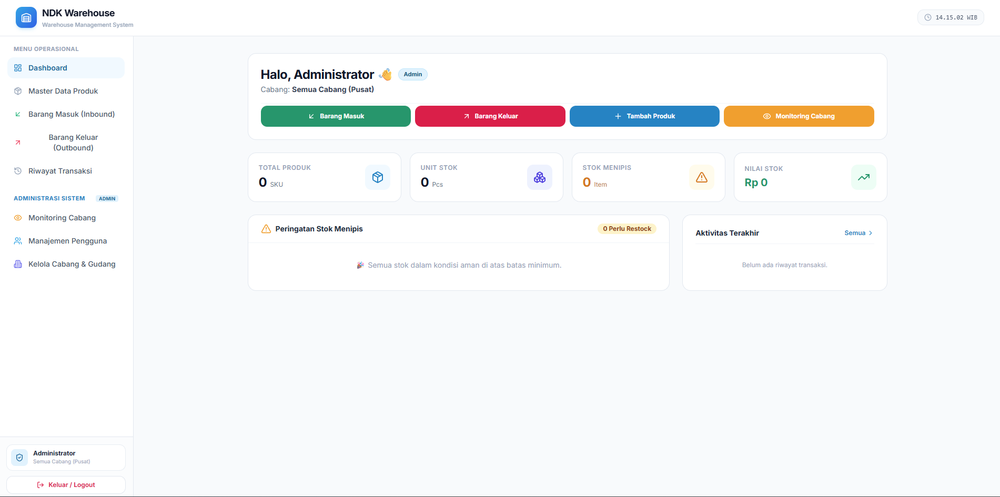
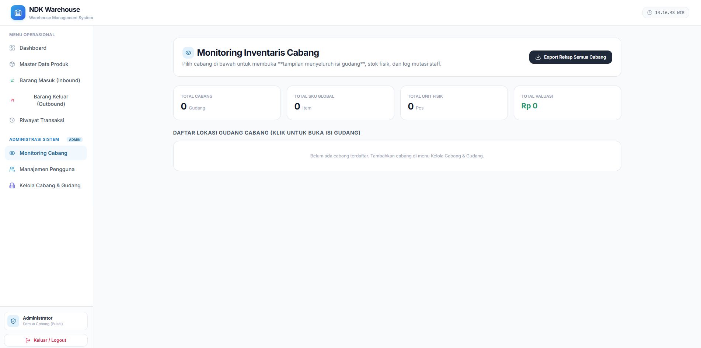
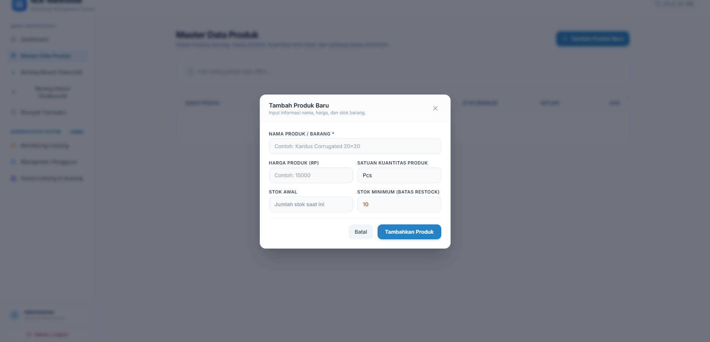

# 📦 NDK Warehouse — Sistem Manajemen Gudang Modern (WMS) V3.0 (Zero-Trust Backend)





---

## 📌 Ringkasan Proyek

**NDK Warehouse (WarehouseZero)** adalah **Sistem Manajemen Gudang (*Warehouse Management System* / WMS)** tingkat perusahaan (*enterprise-ready*) modern yang dirancang dengan arsitektur **Zero-Trust Backend Mutation** dan **Full-System Realtime Live Data Stream**.

Aplikasi ini memastikan konsistensi data inventaris multi-cabang, mencegah nota fiktif, mengisolasi informasi HPP/margin keuntungan, mempercepat alur transfer barang antar-gudang, serta menyediakan notifikasi dan sinkronisasi data langsung tanpa perlu me-refresh halaman (*zero-refresh*).

Dibangun menggunakan stack teknologi modern: **React 19**, **Vite 6**, **Tailwind CSS 3**, **Google Firebase Cloud Firestore**, dan **Firebase Cloud Functions (TypeScript)**.

---

## 🔄 Pembaruan & Fitur Terbaru (Changelog)

### ✨ Fitur Baru yang Ditambahkan
1. **Full-System Realtime Live Data Stream & Live Notification (`onSnapshot`)**:
   - Seluruh modul data (Notifikasi, Master Produk, Mutasi Stok/Transaksi, Transfer Barang, Permintaan Stok, dan Inventaris Cabang) terhubung via **WebSocket Stream Realtime Firestore**.
   - Setiap ada mutasi, pengiriman, atau notifikasi baru, data langsung ter-update di layar user lain secara instan (< 50 milidetik).
   - Dilengkapi **Web Audio Notification Chime** (nada dering halus) dan **Floating Live Notification Toast** di pojok kanan atas layar dengan tautan akses satu klik (*deep-linking*).
2. **Branch-Grouped Inventory Approvals (Pengelompokan Pengajuan per Cabang)**:
   - Di menu Persetujuan Inventaris Cabang, pengajuan stok fisik dikelompokkan rapi ke dalam **Card Cabang** masing-masing lengkap dengan akordion rincian produk.
   - **1-Click "Setujui Semua (Approve All)"**: Admin dapat memverifikasi dan menyetujui seluruh pengajuan suatu cabang sekaligus dalam 1 transaksi batch paralel.
   - **"Tolak / Decline" dengan Deskripsi Wajib**: Dilengkapi form dialog yang mewajibkan Admin mengisi alasan penolakan yang otomatis terkirim sebagai notifikasi resmi ke cabang.
3. **Surat Jalan Grouped Inbound (Penerimaan Stok Cabang Terpadu)**:
   - Kiriman barang dari Pusat dikelompokkan secara otomatis berdasarkan **Nomor Surat Jalan (Delivery Note)**.
   - **1-Click "Terima Semua Paket"**: Cabang dapat mengonfirmasi penerimaan seluruh produk dalam surat jalan sekaligus, dengan penambahan kuantitas otomatis ke database `branch_inventories`.
   - **"Tolak / Retur Kiriman"**: Fasilitas penolakan kiriman dengan alasan resmi yang ternotifikasi ke Pusat.
4. **Universal Interactive Confirmation Modal (`ConfirmationModal.jsx`)**:
   - Standardisasi modal konfirmasi interaktif Glassmorphism di seluruh aksi sistem (Inbound Manifest, Outbound POS & Transfer, Penyesuaian Stok/Stock Opname, Pembuatan/Edit/Hapus Master Produk, Akun Pengguna, dan Cabang).
5. **Unified Branch Inventory Physical Stock Registration**:
   - Penyederhanaan alur pendaftaran stok fisik cabang menjadi 1 alur terpadu dari katalog master resmi.
   - Otomatisasi pembebasan pengajuan bagi Gudang Utama Pusat sebagai pemilik master katalog.
6. **Multi-Key Robust Branch Matching & Realtime Monitoring**:
   - Modul Monitoring Cabang kini mendukung pencocokan cerdas multi-key (ID dokumen Firestore, kode cabang, dan nama cabang) serta mekanisme auto-deduplikasi data stok.
7. **Consolidated Batch Notifications**:
   - Pengajuan multi-item menghasilkan 1 notifikasi terpadu untuk mencegah spam notifikasi per item.

---

### 🧹 Fitur & Kode yang Dihapus / Dioptimalkan (*Pruned & Optimized*)
1. **Dihapus: Pengajuan Inventaris Terpisah / Terpecah**: Menghapus opsi pengajuan bertahap yang redundan menjadi 1 alur input terpadu.
2. **Dihapus: Eksekusi Serial Lambat (Sequential Loop Writes)**: Menggantikan perulangan penulisan serial yang memicu delay lama dan loading berulang (3x) menjadi eksekusi batch paralel (`Promise.all`) dengan 1 kali sinkronisasi state.
3. **Dihapus: Native Browser Alerts & Confirmations**: Menghapus seluruh penggunaan `window.confirm()` dan `window.alert()` browser yang kaku, digantikan dengan modal komponen interaktif.
4. **Dibersihkan: Dokumen Inventaris Duplikat**: Menghapus data duplikasi lama di Firestore dan menstandarkan ID referensi cabang.

---

## 🏗️ Arsitektur Keamanan: Zero-Trust Backend Mutation

Sistem ini menerapkan prinsip **Zero-Trust Backend Mutation**, di mana klien (*web browser / POS terminal*) **DILARANG KERAS** melakukan modifikasi langsung (`updateDoc`, `setDoc`, `addDoc`) pada koleksi data krusial seperti stok barang, transaksi penjualan, invoice, dan log audit. Semua operasi penulisan sensitif wajib mengeksekusi **Firebase Cloud Functions** yang berjalan pada **Firebase Admin SDK** yang terlindungi.

```text
┌──────────────────────────────────────────────────────────────────────────────────────────┐
│                                CLIENT TIER (Web / POS / Mobile)                          │
│   • Staff Cabang & Pusat HANYA memiliki izin READ terisolasi (Scoped Query).             │
│   • Client DILARANG KERAS melakukan `updateDoc()`, `setDoc()`, atau `addDoc()` langsung   │
│     ke koleksi sensitif (`branch_stocks`, `sales_transactions`, `invoices`).             │
└────────────────────────────────────────────┬─────────────────────────────────────────────┘
                                             │ (HTTPS Callable with Auth Token)
                                             ▼
┌──────────────────────────────────────────────────────────────────────────────────────────┐
│                         CLOUD FUNCTIONS TIER (Firebase Admin SDK)                        │
│   1. `processPOSSale()`           -> Validasi Stok + Atomic Decrement + Record Sale      │
│   2. `processCustomBundlingSale()`-> Validasi Komponen + Atomic Decrement + Record Bundle│
│   3. `confirmTransferReceipt()`   -> Validasi State + Increment Branch Stock + Close DO  │
│   4. `createStockTransfer()`      -> Validasi Overdue Piutang + Credit Limit Guard       │
│   5. `setUserRoleAndBranch()`     -> Set Claims + Revoke Token Cache                     │
│   6. `updateBranchCreditLimit()`  -> Admin Only + Write to Immutable Audit Log           │
└────────────────────────────────────────────┬─────────────────────────────────────────────┘
                                             │ (Admin SDK Bypass Rules)
                                             ▼
┌──────────────────────────────────────────────────────────────────────────────────────────┐
│                                   DATABASE TIER (Firestore)                              │
│   • `/branch_stocks`          -> `allow write: if false;` (Kebal manipulasi client)      │
│   • `/sales_transactions`     -> `allow write: if false;` (Kebal nota fiktif/palsu)      │
│   • `/product_pricings`       -> `allow write: if false;` (HPP & Margin aman total)      │
│   • `/invoices`               -> `allow write: if false;` (Status piutang anti-tamper)   │
└──────────────────────────────────────────────────────────────────────────────────────────┘
```

---

## 🌟 Fitur Utama Sistem

### 🔐 1. Keamanan Firestore Security Rules V3.0
- **Locked Stock Mutation**: Koleksi `/branch_stocks` dan `/sales_transactions` dikunci dengan aturan `allow write: if false;`, menutup total celah manipulasi stok dari peramban.
- **Isolasi Harga Privat**: Koleksi `/product_pricings` (HPP/COGS, harga distributor, harga reseller) dipisahkan dari katalog produk umum.
- **Scoped Read Access**: Staf cabang hanya diizinkan membaca data stok, transaksi, dan surat jalan milik cabang mereka sendiri.

### ⚡ 2. Core Cloud Functions (Atomic Mutator Engine)
1. **`processPOSSale`**: Memvalidasi kuantitas item & ketersediaan stok cabang, memotong stok secara atomik (`runTransaction`), dan mencatat nota transaksi penjualan.
2. **`confirmTransferReceipt`**: Mengelola transisi *strict state machine* perpindahan barang (`IN_TRANSIT` ➔ `RECEIVED`), menambah stok cabang tujuan secara atomik, serta menutup status Surat Jalan.
3. **`setUserRoleAndBranch`**: Mengatur Custom Claims (`role`, `branch_id`, `branch_type`), memicu pemutusan sesi instan (`revokeRefreshTokens`), dan menyinkronkan profil pengguna.
4. **`updateBranchCreditLimit`**: Memperbarui limit kredit cabang oleh Admin dan mencatat jejak audit permanen di `/credit_limit_audit_logs`.
5. **`createStockTransfer`**:
   - **Overdue AR Guard**: Memblokir pengiriman jika cabang tujuan memiliki invoice jatuh tempo yang belum lunas.
   - **Multi-tier Pricing**: Menghitung valuasi berdasarkan tipe cabang (`DISTRIBUTOR`, `RESELLER`, `INTERNAL`).
   - **Credit Limit Plafon Guard**: Menolak transfer jika akumulasi piutang + transfer baru melebihi limit kredit.
   - **Atomic Central Stock Decrement**: Memotong stok gudang pusat dan menerbitkan surat jalan + invoice piutang secara bersamaan.

### 🏢 3. Manajemen Multi-Cabang & Monitoring Pusat
- Dashboard pemantauan valuasi stok global, piutang berjalan (*Outstanding AR*), penggunaan limit kredit, dan distribusi barang per cabang secara real-time.
- Mendukung tipe kemitraan cabang: `INTERNAL` (Gudang/Cabang Sendiri), `DISTRIBUTOR`, dan `RESELLER`.
- Skema termin pembayaran yang disesuaikan: `CASH`, `TEMPO_7_HARI`, `TEMPO_14_HARI`, `TEMPO_30_HARI`.

### 📦 4. Katalog Produk, Pengajuan Inventaris & Barcode Engine
- Manajemen Katalog Master Produk, Merek (Brand), dan Kategori Mesin.
- Direct Stock Quantity Editing langsung dari katalog inventaris dengan pencatatan riwayat audit log.
- Alur Pengajuan Inventaris Cabang (*Branch Inventory Request & Approval Workflow*).
- Generator Label Barcode (Code128) dan QR Code interaktif bawaan berbasis `bwip-js`.
- Pemindai Barcode & QR Code langsung melalui kamera perangkat berbasis `html5-qrcode`.
- Ekspor riwayat transaksi & inventaris ke format spreadsheet CSV.

### 🛒 5. Penjualan Produk Terpadu (Omnichannel POS & Bundling)
- **Omnichannel Platform Selection**: Mendukung pencatatan transaksi dari berbagai saluran penjualan: **Toko Fisik / Offline (Kasir)**, **Shopee**, **Tokopedia**, **TikTok Shop**, dan **Direct Channel / Lainnya**.
- **Unified Satuan & Bundling**: Fleksibilitas memilih format penjualan per Pcs (satuan) atau Paket Bundling Combo dalam 1 wadah terpadu.
- **Pencegahan & Penggabungan Otomatis Duplikasi Barang**: Logika cerdas yang mencegah duplikasi komponen dalam paket bundling.
- **Detail Transaksi & Pembayaran**: Pencatatan Nama Pembeli/Pemesan, No. Nota/Resi Marketplace, dan Metode Pembayaran (`CASH`, `TRANSFER`, `QRIS`, `MARKETPLACE_ESCROW`).

### 📋 6. Multi-Item Staging Cart & Custom Modals
- **Staging Cart Inbound & Outbound**: Alur barang masuk (`StockIn.jsx`) dan keluar (`StockOut.jsx`) menggunakan Staging Table terpadu dengan penyuntingan kuantitas langsung secara *inline*.
- **Pencarian Cepat & Barcode**: Dilengkapi komponen `ProductSearchPicker` dan *Instant Camera Scanner* untuk memindai Barcode/QR Code.
- **Universal Confirmation Modal**: Konfirmasi transaksional dengan detail ringkasan dan indikator status.

---

## 🛠️ Teknologi & Library

| Komponen / Layer | Teknologi / Library | Deskripsi |
| :--- | :--- | :--- |
| **Frontend Framework** | [React 19](https://react.dev/) + [Vite 6](https://vitejs.dev/) | Framework SPA modern dengan performa tinggi & Fast Refresh |
| **Styling & UI** | [Tailwind CSS 3](https://tailwindcss.com/) + [Lucide React](https://lucide.dev/) | Responsive Utility-first CSS & Ikonografi modern |
| **Database & Cloud** | [Google Firebase v11](https://firebase.google.com/) | Cloud Firestore DB real-time (`onSnapshot`) & Authentication |
| **Backend Mutator Engine** | [Firebase Cloud Functions v5](https://firebase.google.com/docs/functions) | Backend Serverless berbasis TypeScript & Firebase Admin SDK |
| **Barcode Generator** | [bwip-js](https://github.com/metafloor/bwip-js) | Rendering barcode 1D/2D (Code128, QR) Canvas / Vector |
| **Camera Scanner** | [html5-qrcode](https://github.com/mebjas/html5-qrcode) | Pemindaian Barcode & QR Code via kamera perangkat |

---

## 🚀 Panduan Memulai (Getting Started)

### 1. Prasyarat Sistem
- Node.js versi 18.x atau lebih baru
- NPM versi 9.x atau lebih baru
- Akun Google Firebase (dengan proyek Firestore & Cloud Functions aktif)

### 2. Instalasi Dependensi

```bash
# Clone repository ini
git clone https://github.com/kukuhdwis/warehousezero.git
cd warehousezero

# Install dependensi frontend web
npm install

# Install dependensi backend Cloud Functions
cd functions
npm install
cd ..
```

### 3. Menjalankan Server Pengembangan (Local Dev)

```bash
npm run dev
```

Buka peramban browser di `http://localhost:5173`.

### 4. Membangun Bundle Produksi (Build)

```bash
# Build bundle frontend React
npm run build

# Compile Cloud Functions TypeScript
cd functions
npm run build
cd ..
```

---

## 🚀 Deployment ke Google Firebase

```bash
# 1. Login ke Firebase CLI
npx firebase-tools login

# 2. Hubungkan ke proyek Firebase Anda
npx firebase-tools use <your-project-id>

# 3. Deploy Firestore Rules & Cloud Functions Backend
npx firebase-tools deploy --only firestore:rules,functions

# 4. Deploy Frontend Web Hosting
npx firebase-tools deploy --only hosting
```

---

## 📁 Struktur Direktori Proyek

```text
warehousezero/
├── firestore.rules             # Aturan Keamanan Firestore V3.0 (Zero-Trust Security Rules)
├── firebase.json               # Konfigurasi Firebase Hosting, Functions & Firestore
├── functions/                  # Cloud Functions Backend (TypeScript)
│   ├── package.json
│   ├── tsconfig.json
│   └── src/
│       └── index.ts            # Atomic Mutator Engine (processPOSSale, confirmTransferReceipt, dll.)
├── public/                     # Aset statis aplikasi
├── src/
│   ├── components/             # Komponen Antarmuka (UI Components)
│   │   ├── BarcodeModal.jsx    # Modal generator & preview label barcode/QR
│   │   ├── BottomNav.jsx       # Navigasi bawah untuk tampilan mobile
│   │   ├── BranchManagement.jsx# CRUD Cabang, Pengaturan Plafon Kredit & Term Payment
│   │   ├── BranchMonitoring.jsx# Dashboard analitik stok cabang & pemantauan realtime
│   │   ├── ConfirmationModal.jsx# Universal modal konfirmasi aksi transaksional
│   │   ├── CustomAlertModal.jsx# Modal notifikasi alert interaktif glassmorphism
│   │   ├── Dashboard.jsx       # Metrik ringkasan KPI & grafik stok
│   │   ├── GlobalSuccessModal.jsx# Modal notifikasi sukses global
│   │   ├── LoginView.jsx       # Halaman login otentikasi
│   │   ├── LogoutConfirmModal.jsx# Modal konfirmasi keluar sistem
│   │   ├── Navbar.jsx          # Header navigasi, live notifikasi & jam real-time
│   │   ├── ProductManagement.jsx# Manajemen master produk, brand, kategori & approval cabang
│   │   ├── ProductSearchPicker.jsx# Komponen pencarian cepat produk
│   │   ├── ScannerModal.jsx    # Modal pemindai kamera barcode/QR
│   │   ├── Sidebar.jsx         # Navigasi menu utama desktop
│   │   ├── StockIn.jsx         # Alur barang masuk gudang (Inbound & transfer surat jalan)
│   │   ├── StockOut.jsx        # Alur barang keluar (Penjualan POS, Bundling & Transfer Pusat)
│   │   ├── TransactionHistory.jsx# Tabel & log riwayat mutasi stok
│   │   ├── TransactionSuccessModal.jsx# Nota struk transaksi sukses
│   │   └── UserManagement.jsx  # Manajemen akun staf, role & penugasan cabang
│   ├── services/               # Layanan Data & API
│   │   ├── authService.js      # Otentikasi Firebase Auth & Token Management
│   │   ├── cloudFunctionsService.js # Penghubung client ke Firebase Cloud Functions
│   │   ├── dataService.js      # Operasi Firestore CRUD & Realtime Listeners (onSnapshot)
│   │   └── firebase.js         # Inisialisasi Firebase App, Auth & Firestore
│   ├── App.jsx                 # Router utama & state container realtime
│   ├── index.css               # Styling Tailwind CSS & kustom animasi
│   └── main.jsx                # Entry point aplikasi React
├── package.json
├── vite.config.js
└── README.md
```

---

## 📄 Lisensi

Hak Cipta © 2026 **NDK Warehouse (WarehouseZero)**. Dikembangkan untuk efisiensi dan keamanan rantai pasok manufaktur dan distribusi multi-cabang.
